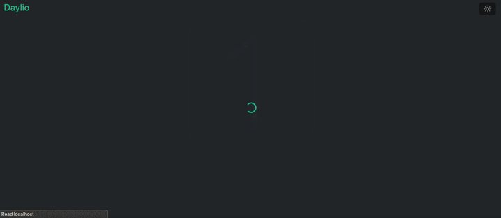
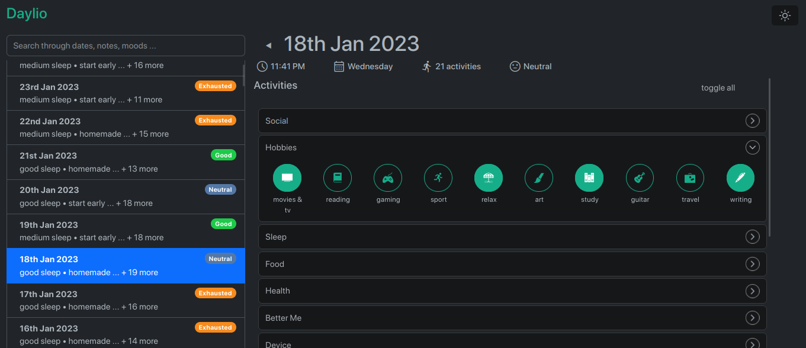
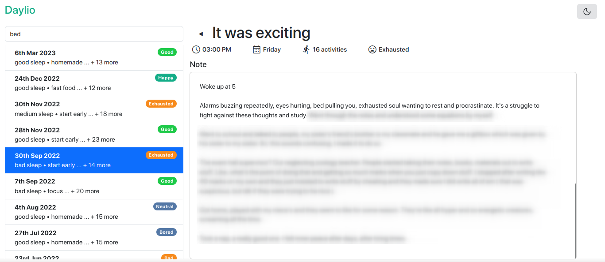

# daylio-web

An unofficial daylio client ( read-only now ), to view your entries, notes, and moods in your browser locally.

Written in node js

## Demo
#### Dashboard

#### Screenshots
|  |  |
|---|---|

## Running

**If you haven't already, install **

* Clone or download this repo
* Export your **Daylio** backup ( .daylio file ) and copy it to the repo directory
* Then, execute the following commands
    *  _NOTE : The `node` and `npm` would differ depending on the platform you're using._
```sh
  npm i
  node server.js <daylio backup file>
```

* Head to http://localhost:<PORT_NUMBER> ( or just simply open the url displayed in the terminal )


You'll only have to pass the daylio backup once, it'd be extracted ( encoded format ) in the `data` folder.

To update your local entry backup, re-run the server while passing your new daylio backup.

## Features

- Light/dark mode
- Monthly mood graph
- Activities ( with icons )
- Moods
- Notes
- Search

## Uses
#### CSS
 - 
 - 
 - 
 
 #### Packages
 -  ( web server )
 -  ( HTML pre-processor )
 - 
 - Other
    * path
    * fs 
    * extract-zip

#### Code Snippet
* Chartist line animation: 
## Help

### Exporting your daylio entries ( backup )
// TO-DO
